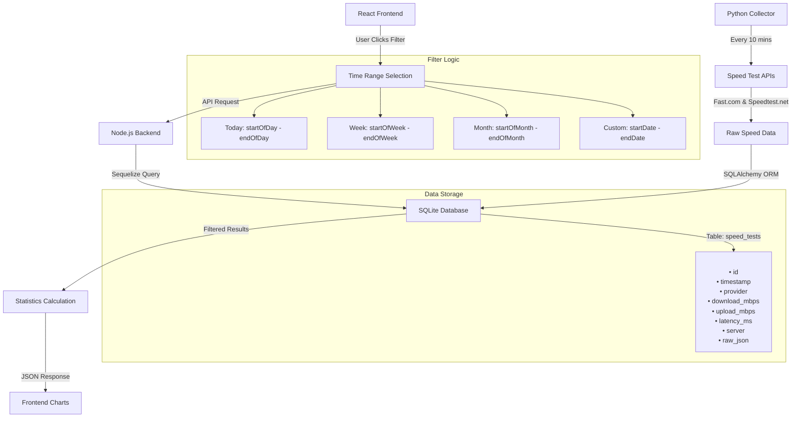

# **Internet Speed Monitor**

A **full-stack internet speed monitoring system** that tracks your internet speed every 10 minutes and visualizes the data on a React dashboard. Perfect for analyzing your ISP performance over time.

---

## **📌 Features**

- ✅ **Python Collector**: Automatically checks internet speed every 10 mins using Fast.com and stores results in a database.
- ✅ **REST API (Node.js)**: Serves speed logs for custom date ranges (day, week, month).
- ✅ **React Dashboard**: Interactive charts and statistics for daily, weekly, and monthly trends.
- ✅ **Data Points**: Download speed, upload speed, latency, timestamp.
- ✅ **Future Enhancements**: Real-time monitoring, system tray app.

---

## **📂 Project Structure**

```
internet-speed-monitor/
│
├── collector/                # Python service (data collector)
│   ├── speed_tracker.py
│   ├── requirements.txt
│   └── README.md
│
├── backend/                  # REST API service
│   ├── src/
│   │   ├── index.js          # Express server entry
│   │   ├── routes/
│   │   │   └── speedRoutes.js
│   │   ├── controllers/
│   │   │   └── speedController.js
│   │   ├── models/
│   │   │   └── SpeedLog.js
│   │   └── db.js             # Database connection
│   ├── package.json
│   ├── .env
│   └── README.md
│
├── frontend/                 # React TypeScript dashboard
│   ├── src/
│   │   ├── components/
│   │   │   ├── Chart.tsx
│   │   │   ├── Filters.tsx
│   │   │   └── StatsCard.tsx
│   │   ├── pages/Dashboard.tsx
│   │   ├── App.tsx
│   │   └── main.tsx
│   ├── vite.config.ts
│   ├── package.json
│   └── README.md
│
└── README.md                 # Main documentation
```

---

## **🛠 Tech Stack**

### **Backend Services**

- **🐍 Collector:** Python 3.11+ with `speedtest-cli`, `httpx`, `SQLAlchemy`
- **🌐 API Server:** Node.js with Express, Sequelize ORM, rate limiting
- **🗄️ Database:** SQLite (development) / PostgreSQL (production ready)

### **Frontend**

- **⚛️ Framework:** React 18 + TypeScript + Vite
- **🎨 Styling:** TailwindCSS v3 with custom components
- **📊 Charts:** Recharts with interactive tooltips and legends
- **📅 Date Handling:** date-fns for smart time range calculations

### **DevOps & Tools**

- **🐳 Containerization:** Docker Compose for multi-service setup
- **🔧 Development:** Hot reload, TypeScript checking, ESLint
- **📝 Documentation:** Swagger/OpenAPI, Mermaid diagrams
- **⚡ Performance:** Indexed database queries, response caching

---

## **🏗️ System Architecture**



## **⚙️ How It Works**

### **🔄 Data Flow Process**

1. **📊 Data Collection (Automated)**

   - Python collector runs speed tests every 10 minutes
   - Tests both Fast.com and Speedtest.net providers
   - Stores results in SQLite database with timestamps

2. **🌐 User Interaction**

   - User selects time range filter (Today/Week/Month/Custom)
   - Frontend sends API request to Node.js backend
   - Backend queries database with date range filters

3. **📈 Data Processing**
   - Backend calculates statistics (avg, max, min speeds)
   - Returns JSON response with filtered data
   - Frontend renders interactive charts and stats cards

### **🛠 API Endpoints**

| Endpoint                                                              | Description         | Example                            |
| --------------------------------------------------------------------- | ------------------- | ---------------------------------- |
| `GET /api/speed?range=day`                                            | Today's speed tests | All tests from 00:00 - 23:59 today |
| `GET /api/speed?range=week`                                           | This week's data    | Monday to Sunday current week      |
| `GET /api/speed?range=month`                                          | This month's data   | 1st to last day of current month   |
| `GET /api/speed?range=custom&startDate=YYYY-MM-DD&endDate=YYYY-MM-DD` | Custom date range   | User-selected period               |

### **📊 Database Schema**

```sql
CREATE TABLE speed_tests (
    id INTEGER PRIMARY KEY,
    timestamp DATETIME NOT NULL,
    provider VARCHAR(32) NOT NULL,     -- 'fast.com' or 'speedtest.net'
    server VARCHAR(128),               -- Server location
    download_mbps FLOAT NOT NULL,      -- Download speed
    upload_mbps FLOAT NOT NULL,        -- Upload speed
    latency_ms FLOAT NOT NULL,         -- Ping/latency
    raw_json TEXT,                     -- Full test results
    created_at DATETIME,
    updated_at DATETIME
);
```

---

### **✨ Key Features**

| Feature                     | Technology                     | Description                                           |
| --------------------------- | ------------------------------ | ----------------------------------------------------- |
| **🤖 Automated Collection** | Python + Asyncio               | Runs speed tests every 10 minutes automatically       |
| **📊 Real-time Dashboard**  | React + TypeScript             | Interactive charts with live data updates             |
| **🎨 Modern UI**            | TailwindCSS + Recharts         | Beautiful, responsive design with smooth animations   |
| **⚡ Fast API**             | Node.js + Express              | RESTful API with optimized database queries           |
| **📱 Time Filters**         | Date-fns + SQL                 | Smart filtering: Today, Week, Month, Custom ranges    |
| **📈 Statistics Engine**    | Sequelize ORM                  | Calculates averages, maximums, minimums automatically |
| **🗄️ Efficient Storage**    | SQLite + Indexing              | Lightweight database with indexed timestamp queries   |
| **🔒 Production Ready**     | Docker + Environment Variables | Containerized setup with proper configuration         |

---

## **📦 Installation**

### **1. Clone the Repository**

```bash
git clone https://github.com/Pin3appl3ishan/internet-speed-monitor.git
cd internet-speed-monitor
```

### **2. Python Collector**

```bash
cd collector
pip install -r requirements.txt
python speed_tracker.py
```

### **3. Backend**

```bash
cd backend
npm install
npm run dev
```

### **4. Frontend**

```bash
cd frontend
npm install
npm run dev
```

---

## **📊 Visualization**

The dashboard shows:

- **Daily trend** (hourly speed points)
- **Weekly/Monthly trend** (aggregated view)
- **Stats**: Avg Download, Avg Upload, Avg Latency

---

## **🔮 Future Enhancements**

- [ ] Real-time updates with WebSockets
- [ ] Push notifications for speed drops
- [ ] Multi-user dashboard
- [ ] Cloud deployment (Render/Heroku + Vercel)

---

## **API Example Response**

```json
{
  "range": "week",
  "average_download": 18.7,
  "average_upload": 5.2,
  "data": [
    {
      "timestamp": "2025-07-22 14:30",
      "download": 18.3,
      "upload": 5.1,
      "latency": 35
    },
    {
      "timestamp": "2025-07-22 14:40",
      "download": 16.7,
      "upload": 4.8,
      "latency": 37
    }
  ]
}
```

---

### ✅ Do you want me to **now generate the starting code for all three parts (collector, backend, frontend) and include mini README for each** so you can just open this in Cursor IDE and start coding?

Or **start with Collector + Backend integration first**?
